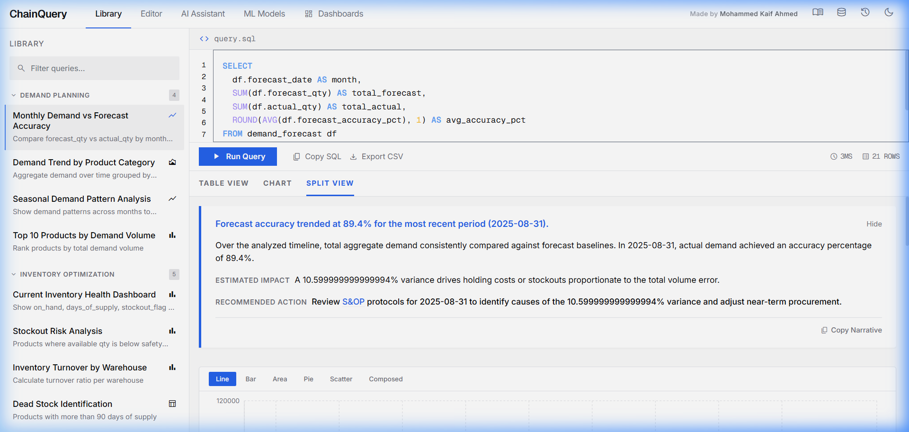
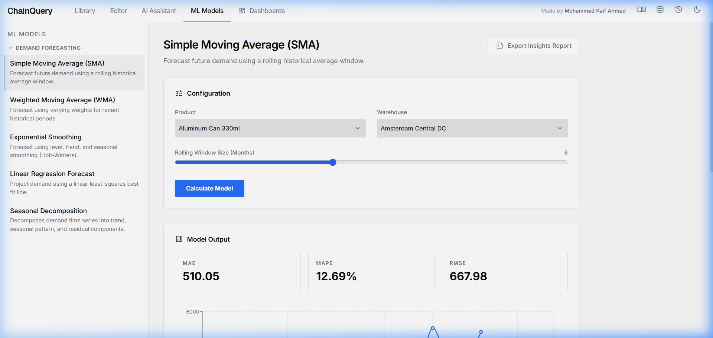
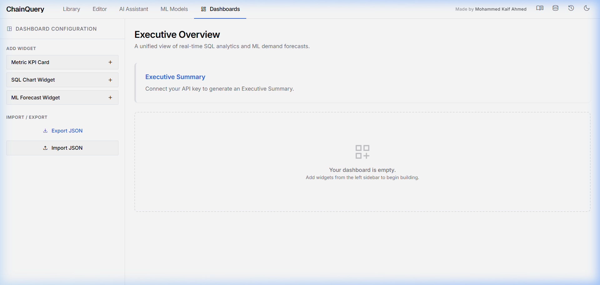

<p align="center">
  <h1 align="center">ChainQuery</h1>
  <p align="center">
    <strong>Supply Chain SQL Analytics &amp; Business Intelligence Platform</strong>
  </p>
  <p align="center">
    A fully in-browser supply chain analytics workbench that combines a live SQL engine, pre-built query library, AI-powered natural language querying, ML demand forecasting models, and an executive dashboard builder — all running client-side with zero backend.
  </p>
  <p align="center">
    <a href="#features">Features</a> •
    <a href="#screenshots">Screenshots</a> •
    <a href="#tech-stack">Tech Stack</a> •
    <a href="#getting-started">Getting Started</a> •
    <a href="#architecture">Architecture</a> •
    <a href="#database-schema">Database Schema</a>
  </p>
</p>

---

## Screenshots

### SQL Query Library & Business Narratives

> Pre-built supply chain queries with auto-generated business narratives that translate raw data into executive-ready insights.

### ML Demand Forecasting Workspace

> Five statistical forecasting models (SMA, WMA, Exponential Smoothing, Linear Regression, Seasonal Decomposition) with interactive parameter tuning and model performance metrics.

### Executive Dashboard Builder

> Drag-and-drop dashboard with Metric KPI cards, SQL Chart widgets, and ML Forecast widgets — all exportable as PDF executive briefs.

---

## Features

### SQL Analytics Engine
- **In-browser SQLite** — Full relational database running entirely in WebAssembly via `sql.js`. No server, no API calls, no latency.
- **Pre-built Query Library** — 20+ curated supply chain queries organized across Demand Planning, Inventory Optimization, Supplier Performance, Production Analytics, and Cross-Functional Analysis.
- **Live SQL Editor** — Write and execute arbitrary SQL with syntax highlighting, query history, and CSV export.
- **Smart Visualization** — Auto-detects the best chart type (line, bar, area, pie, scatter, composed) for any result set. Switch between Table View, Chart View, and Split View.

### AI Assistant
- **Natural Language → SQL** — Ask questions in plain English (e.g., *"Which suppliers have declining on-time delivery?"*) and get executable SQL generated via the Claude API.
- **Conversational Context** — Multi-turn conversation history for iterative analysis.

### Business Narrative Intelligence
- **Every number tells a story** — Query results, ML outputs, and dashboard widgets automatically produce plain-language business narratives answering: *What is happening? Why does it matter? What should we do?*
- **Template Narratives** — Pre-built queries generate instant offline narratives without needing an API key.
- **AI Narratives** — Ad-hoc SQL queries use Claude to synthesize context, financial impact, and recommended actions.
- **Interactive Business Glossary** — 50+ supply chain terms (MAPE, Safety Stock, Bullwhip Effect, OEE, etc.) are automatically detected in narrative text and linked to hoverable tooltips with definitions and industry benchmarks.
- **PDF Export** — Export any insight panel or full dashboard as a rasterized PDF executive brief.

### ML Demand Forecasting
- **5 Statistical Models**:
  - Simple Moving Average (SMA)
  - Weighted Moving Average (WMA)
  - Holt-Winters Exponential Smoothing
  - Linear Regression Forecast
  - Seasonal Decomposition
- **Interactive Tuning** — Adjust smoothing parameters (alpha, beta, gamma), window sizes, season lengths, and custom weights in real-time.
- **Model Metrics** — MAE, MAPE, and RMSE calculated on the validation period.
- **Visual Output** — Historical actuals, model fit, and forecast projections rendered on interactive Recharts line charts.

### Executive Dashboard Builder
- **Widget System** — Add Metric KPI Cards, SQL Chart Widgets, and ML Forecast Widgets to a responsive auto-flowing grid.
- **Executive Summary** — AI-generated dashboard-wide synthesis with traffic-light health rating (Green / Amber / Red).
- **Persistent State** — Dashboards auto-save to `localStorage` and survive page refreshes.
- **Import / Export** — Share dashboards as JSON files between users.

### Additional Features
- **Schema Explorer** — Browse all 7 tables with column types, foreign keys, and row previews.
- **Query History** — Last 20 queries with execution time and row counts for quick replay.
- **Dark / Light Mode** — Full theme system with CSS custom properties.
- **Responsive Design** — Optimized for desktop and tablet viewports.

---

## Tech Stack

| Layer | Technology |
|-------|-----------|
| **Framework** | React 18 |
| **Build Tool** | Vite 6 |
| **Database** | sql.js (SQLite compiled to WebAssembly) |
| **Charts** | Recharts |
| **ML / Statistics** | simple-statistics + custom implementations |
| **PDF Export** | jsPDF + html2canvas |
| **AI Integration** | Anthropic Claude API (optional, for AI Assistant & narrative generation) |
| **Styling** | Tailwind CSS + Material Design 3 token system |

---

## Getting Started

### Prerequisites
- **Node.js** ≥ 18
- **npm** ≥ 9

### Installation

```bash
# Clone the repository
git clone https://github.com/Kaif198/Chain-Query.git
cd Chain-Query

# Install dependencies
npm install

# Start the development server
npm run dev
```

The app will open at `http://localhost:5173/`. No database setup required — the supply chain database is seeded automatically in-browser on first load.

### Optional: AI Features

To enable the AI Assistant and AI-generated business narratives:

1. Get an API key from [Anthropic](https://console.anthropic.com/)
2. Open the **AI Assistant** tab in ChainQuery
3. Paste your API key in the input field

> **Note:** The app works fully without an API key. Pre-built queries use offline template narratives, and all SQL/ML/Dashboard features function independently.

### Build for Production

```bash
npm run build
npm run preview
```

---

## Architecture

```
src/
├── App.jsx                    # Root component, ApiContext & DbContext providers
├── main.jsx                   # Entry point
├── index.css                  # Global styles
│
├── components/
│   ├── TopBar.jsx             # Navigation tabs & toolbar
│   ├── Sidebar.jsx            # Query library browser
│   ├── SQLEditorPanel.jsx     # Code editor with run controls
│   ├── AIPanel.jsx            # Claude-powered natural language interface
│   ├── ResultsPanel.jsx       # Split view: narrative + chart + table
│   ├── DataTablePanel.jsx     # Sortable data grid
│   ├── NarrativePanel.jsx     # Business insight renderer (headline, context, impact, action)
│   ├── GlossaryTooltip.jsx    # Inline term detection & hover definitions
│   ├── GlossaryPanel.jsx      # Searchable glossary drawer
│   ├── ExecutiveSummaryWidget.jsx  # AI dashboard synthesis with health rating
│   ├── MLWorkspace.jsx        # ML model selection, tuning, and output
│   ├── DashboardWorkspace.jsx # Widget grid builder
│   ├── SchemaPanel.jsx        # Database schema explorer
│   ├── HistoryPanel.jsx       # Query execution history
│   ├── Icon.jsx               # Material Symbols wrapper
│   └── widgets/
│       ├── MetricWidget.jsx   # KPI card (SQL-powered, configurable)
│       ├── ChartWidget.jsx    # Chart card (SQL-powered, multi-type)
│       └── ForecastWidget.jsx # ML forecast mini-widget
│
├── db/
│   ├── seed.js                # Schema creation & procedural data generation
│   └── queries.js             # Pre-built query library (20+ queries, 5 categories)
│
├── models/
│   ├── demand.js              # SMA, WMA, Exponential Smoothing, Linear Regression, Seasonal Decomposition
│   └── mathUtils.js           # Statistical helper functions
│
└── utils/
    ├── chartUtils.js          # Auto chart type detection & data transformation
    ├── sqlUtils.js            # SQL parsing utilities
    ├── llm.js                 # Anthropic API integration (narrative + SQL generation)
    ├── glossary.js            # 50+ supply chain term definitions & benchmarks
    ├── templateNarratives.js  # Offline narrative generators for pre-built queries
    └── exportUtils.js         # PDF generation (jsPDF + html2canvas)
```

---

## Database Schema

The app ships with a fully seeded supply chain database containing **7 relational tables** and thousands of procedurally generated records modeled after a global beverage manufacturing operation.

| Table | Records | Description |
|-------|---------|-------------|
| `products` | 15 | Product master data (packaging, raw materials, finished goods, components) |
| `suppliers` | 8 | Global supplier network across EMEA, APAC, and Americas |
| `warehouses` | 6 | Distribution centers (Amsterdam, Frankfurt, Singapore, Chicago, São Paulo, Dubai) |
| `demand_forecast` | ~2,000 | Monthly demand forecasts with actuals and accuracy metrics |
| `inventory_snapshots` | ~1,800 | Monthly inventory positions (on-hand, in-transit, days of supply, stockout flags) |
| `purchase_orders` | 180 | PO lifecycle tracking (Open → In Transit → Delivered / Delayed / Cancelled) |
| `production_plans` | ~768 | Weekly production execution with shift efficiency and downtime |
| `supplier_performance` | ~168 | Monthly supplier scorecards (OTD, quality, fill rate, cost variance) |

### Entity Relationship

```
products ──────────┐
                   ├── demand_forecast
warehouses ────────┤
                   ├── inventory_snapshots
suppliers ─────────┤
                   ├── purchase_orders
                   ├── production_plans
                   └── supplier_performance
```

---

## Query Library Categories

| Category | Queries | Examples |
|----------|---------|---------|
| **Demand Planning** | 4 | Forecast accuracy trends, demand by category, seasonal patterns, top products by volume |
| **Inventory Optimization** | 5 | Inventory health dashboard, stockout risk analysis, turnover by warehouse, dead stock identification, reorder alerts |
| **Supplier Performance** | 4 | Supplier scorecard, on-time delivery trends, cost variance analysis, supplier risk assessment |
| **Production Analytics** | 4 | Line efficiency trends, shift performance comparison, downtime analysis, capacity utilization |
| **Cross-Functional** | 3 | End-to-end supply chain overview, working capital analysis, supply-demand alignment |

---

## Key Design Decisions

- **Zero Backend** — Everything runs in the browser. The SQLite database is created in WebAssembly memory on page load. This means the app can be deployed as a static site on any CDN.
- **Graceful AI Degradation** — Every feature that uses the Anthropic API has an offline fallback. No API key? You still get full SQL analytics, ML forecasting, and template-based business narratives.
- **Narrative-First Design** — Every data output answers three questions: *What is happening?* (the fact), *Why does it matter?* (the business impact), and *What should we do?* (the recommended action). Technical jargon is reserved for tooltips.
- **Rasterized PDF Exports** — Charts are captured at 2× device pixel ratio using html2canvas for crisp PDF renders suitable for email attachments and S&OP decks.

---

## License

This project is open source and available under the [MIT License](LICENSE).

---

<p align="center">
  Made by <strong>Mohammed Kaif Ahmed</strong>
</p>
